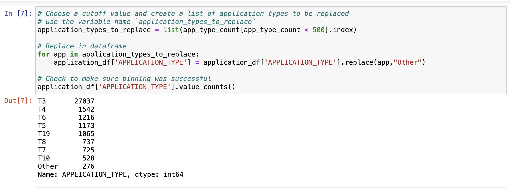
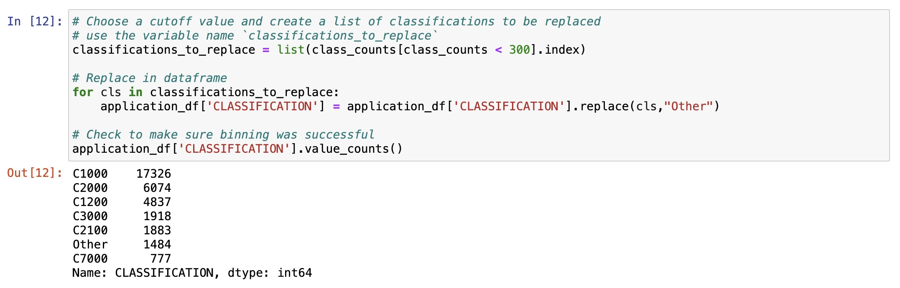
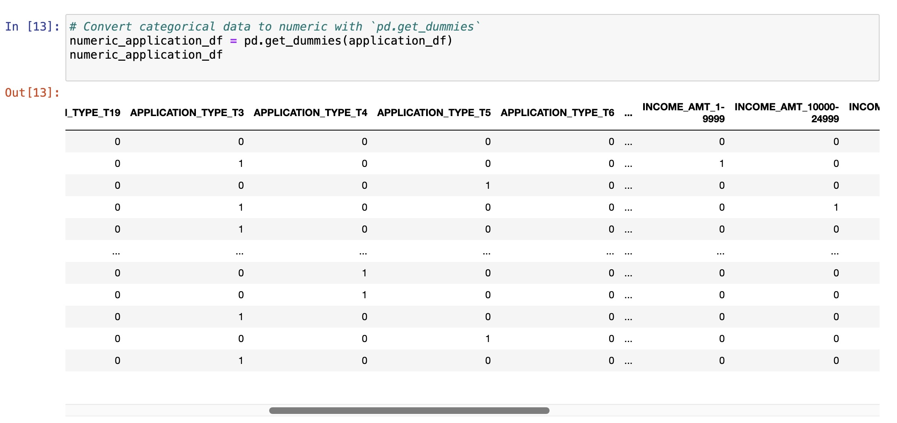
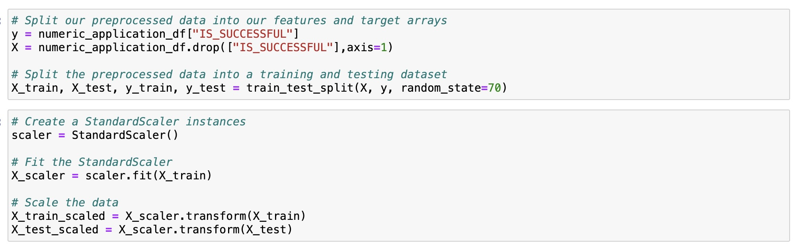
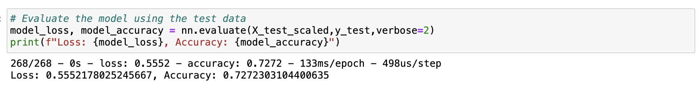
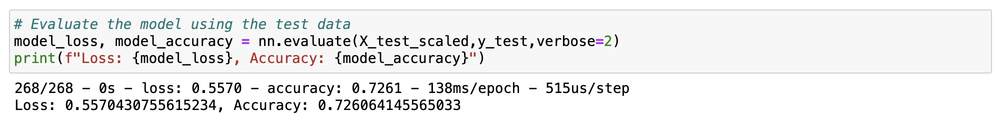
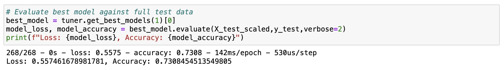
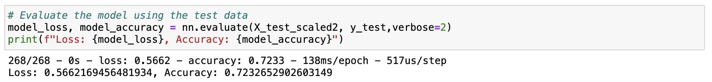
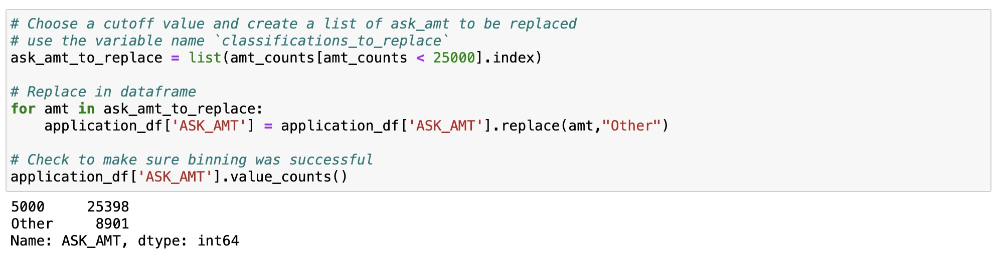

# Deep-Learning-Challenge

### Overview

The purpose of this analysis is to create a deep learning classifier model for the nonprofit foundation Alphabet Soup. This model will help Alphabet Soup select the applicants for funding with the best chance of success in their ventures. The model will analyze a dataset that contains more than 34,000 organizations that have received funding from Alphabet Soup over the years.

### Results

#### Data Preprocessing

- "EIN" and "NAME" columns were removed from the dataset since they are identification columns, and are neither targets nor features.
- Features columns include:
    - APPLICATION_TYPE
    - AFFILIATION
    - CLASSIFICATION
    - USE_CASE—Use 
    - ORGANIZATION
    - STATUS—Active status
    - INCOME_AMT
    - SPECIAL_CONSIDERATIONS
    - ASK_AMT
- Target column is:
    - IS_SUCCESSFUL
- A a cutoff point was chosen and binning was used for the columns that had more than 10 unique values to bin rare categorical values together into a new value called "Other", using pd.get_dummies() to convert categorical data to numeric. 

  

  

  

- Train_test_split was used to create a testing and a training dataset.
- StandardScaler was used to scale the training and testing sets.

  

#### Compiling, Training, and Evaluating the Model

Four attempts were made using machine learning and neural networks to achieve the target model performance at predictive accuracy higher than 75%. The results of the three attempts were as follows:

ATTEMPT No 1: 

  

- Accuracy score is 72.7%
- No of hidden layers = 2
- First layer: 90 neurons : activation function = ‘relu’
- Second layer: 30 neurons : activation function = ‘relu’
- Output layer: activation function = ‘sigmoid’
- epochs = 100

ATTEMPT No 2: 

  

- Accuracy score is 72.6%
- No of hidden layers = 3
- First layer: 100 neurons : activation function = ‘relu’
- Second layer: 45 neurons : activation function = ‘relu’
- Third layer: 30 neurons : activation function = ‘tanh’
- Output layer: activation function = ‘sigmoid’
- epochs = 150

ATTEMPT No 3: 

  

- Accuracy score is 73%
- Created a method that lets the model decide the activation function to use in hidden layers, number of hidden layers (1-6) and neurons in hidden layers.
- Output layer: activation function = ‘sigmoid’
- epochs = 200

ATTEMPT No 4: 

  

- Accuracy score is 72.3%
- A a cutoff point was chosen and binning was used for an additional column that had more than 10 unique values "ASK_AMT"

  

- No of hidden layers = 3
- First layer: 90 neurons : activation function = ‘relu’
- Second layer: 45 neurons : activation function = ‘relu’
- Third layer: 15 neurons : activation function = ‘sigmoid’
- Output layer: activation function = ‘sigmoid’
- epochs = 300

### Summary

After all the attempts that were made, the model was not able to achieve the target performance which was at 75% predictive accuracy, however, the highest the model was able to achieve was 73%, which was the result of creating a method that let the model decide which activation functions to use in hidden layers, as well as the number of hidden layers and neurons in hidden layers. Since none of the models achieved the target performance, I would recommend exploring other classification models. 

